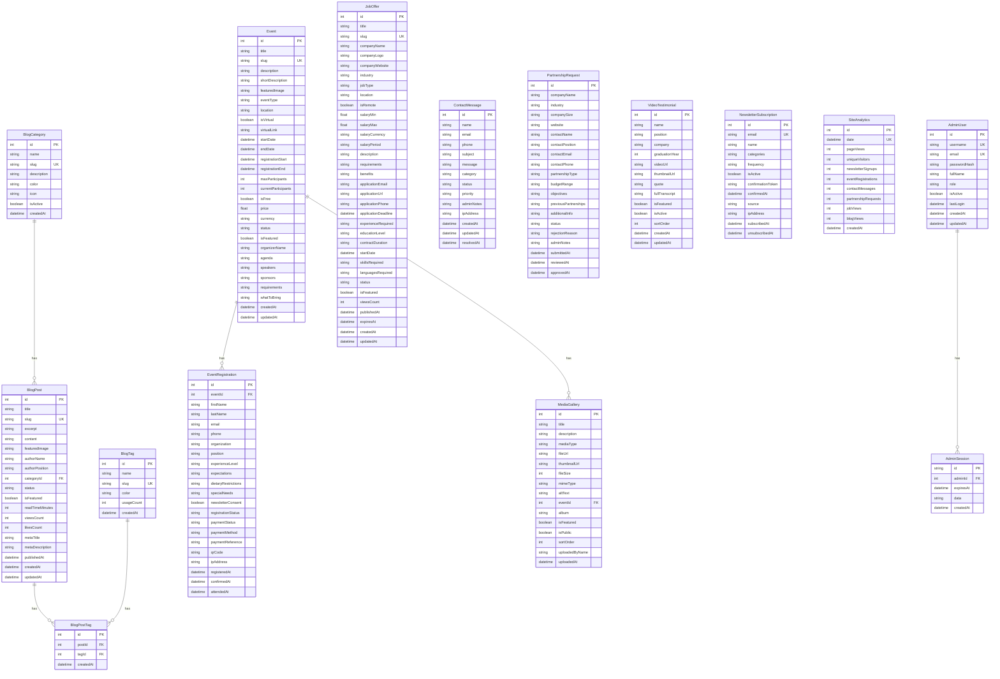

# Database Schema - Forum Génie

```mermaid
    erDiagram
        %% BLOG SECTION
        BlogCategory ||--o{ BlogPost : "has"
        BlogPost ||--o{ BlogPostTag : "has"
        BlogTag ||--o{ BlogPostTag : "has"
        
        BlogCategory {
            int id PK
            string name
            string slug UK
            string description
            string color
            string icon
            boolean isActive
            datetime createdAt
        }
        
        BlogPost {
            int id PK
            string title
            string slug UK
            string excerpt
            string content
            string featuredImage
            string authorName
            string authorPosition
            int categoryId FK
            string status
            boolean isFeatured
            int readTimeMinutes
            int viewsCount
            int likesCount
            string metaTitle
            string metaDescription
            datetime publishedAt
            datetime createdAt
            datetime updatedAt
        }
        
        BlogTag {
            int id PK
            string name
            string slug UK
            string color
            int usageCount
            datetime createdAt
        }
        
        BlogPostTag {
            int id PK
            int postId FK
            int tagId FK
            datetime createdAt
        }
        
        %% EVENTS SECTION
        Event ||--o{ EventRegistration : "has"
        Event ||--o{ MediaGallery : "has"
        
        Event {
            int id PK
            string title
            string slug UK
            string description
            string shortDescription
            string featuredImage
            string eventType
            string location
            boolean isVirtual
            string virtualLink
            datetime startDate
            datetime endDate
            datetime registrationStart
            datetime registrationEnd
            int maxParticipants
            int currentParticipants
            boolean isFree
            float price
            string currency
            string status
            boolean isFeatured
            string organizerName
            string agenda
            string speakers
            string sponsors
            string requirements
            string whatToBring
            datetime createdAt
            datetime updatedAt
        }
        
        EventRegistration {
            int id PK
            int eventId FK
            string firstName
            string lastName
            string email
            string phone
            string organization
            string position
            string experienceLevel
            string expectations
            string dietaryRestrictions
            string specialNeeds
            boolean newsletterConsent
            string registrationStatus
            string paymentStatus
            string paymentMethod
            string paymentReference
            string qrCode
            string ipAddress
            datetime registeredAt
            datetime confirmedAt
            datetime attendedAt
        }
        
        %% JOB OFFERS
        JobOffer {
            int id PK
            string title
            string slug UK
            string companyName
            string companyLogo
            string companyWebsite
            string industry
            string jobType
            string location
            boolean isRemote
            float salaryMin
            float salaryMax
            string salaryCurrency
            string salaryPeriod
            string description
            string requirements
            string benefits
            string applicationEmail
            string applicationUrl
            string applicationPhone
            datetime applicationDeadline
            string experienceRequired
            string educationLevel
            string contractDuration
            datetime startDate
            string skillsRequired
            string languagesRequired
            string status
            boolean isFeatured
            int viewsCount
            datetime publishedAt
            datetime expiresAt
            datetime createdAt
            datetime updatedAt
        }
        
        %% CONTACT & PARTNERSHIPS
        ContactMessage {
            int id PK
            string name
            string email
            string phone
            string subject
            string message
            string category
            string status
            string priority
            string adminNotes
            string ipAddress
            datetime createdAt
            datetime updatedAt
            datetime resolvedAt
        }
        
        PartnershipRequest {
            int id PK
            string companyName
            string industry
            string companySize
            string website
            string contactName
            string contactPosition
            string contactEmail
            string contactPhone
            string partnershipType
            string budgetRange
            string objectives
            string previousPartnerships
            string additionalInfo
            string status
            string rejectionReason
            string adminNotes
            datetime submittedAt
            datetime reviewedAt
            datetime approvedAt
        }
        
        %% MEDIA & TESTIMONIALS
        MediaGallery {
            int id PK
            string title
            string description
            string mediaType
            string fileUrl
            string thumbnailUrl
            int fileSize
            string mimeType
            string altText
            int eventId FK
            string album
            boolean isFeatured
            boolean isPublic
            int sortOrder
            string uploadedByName
            datetime uploadedAt
        }
        
        VideoTestimonial {
            int id PK
            string name
            string position
            string company
            int graduationYear
            string videoUrl
            string thumbnailUrl
            string quote
            string fullTranscript
            boolean isFeatured
            boolean isActive
            int sortOrder
            datetime createdAt
            datetime updatedAt
        }
        
        %% NEWSLETTER
        NewsletterSubscription {
            int id PK
            string email UK
            string name
            string categories
            string frequency
            boolean isActive
            string confirmationToken
            datetime confirmedAt
            string source
            string ipAddress
            datetime subscribedAt
            datetime unsubscribedAt
        }
        
        %% ANALYTICS
        SiteAnalytics {
            int id PK
            datetime date UK
            int pageViews
            int uniqueVisitors
            int newsletterSignups
            int eventRegistrations
            int contactMessages
            int partnershipRequests
            int jobViews
            int blogViews
            datetime createdAt
        }
        
        %% ADMIN
        AdminUser ||--o{ AdminSession : "has"
        
        AdminUser {
            int id PK
            string username UK
            string email UK
            string passwordHash
            string fullName
            string role
            boolean isActive
            datetime lastLogin
            datetime createdAt
            datetime updatedAt
        }
        
        AdminSession {
            string id PK
            int adminId FK
            datetime expiresAt
            string data
            datetime createdAt
        }

   %% Collez tout le code du diagramme ici
```